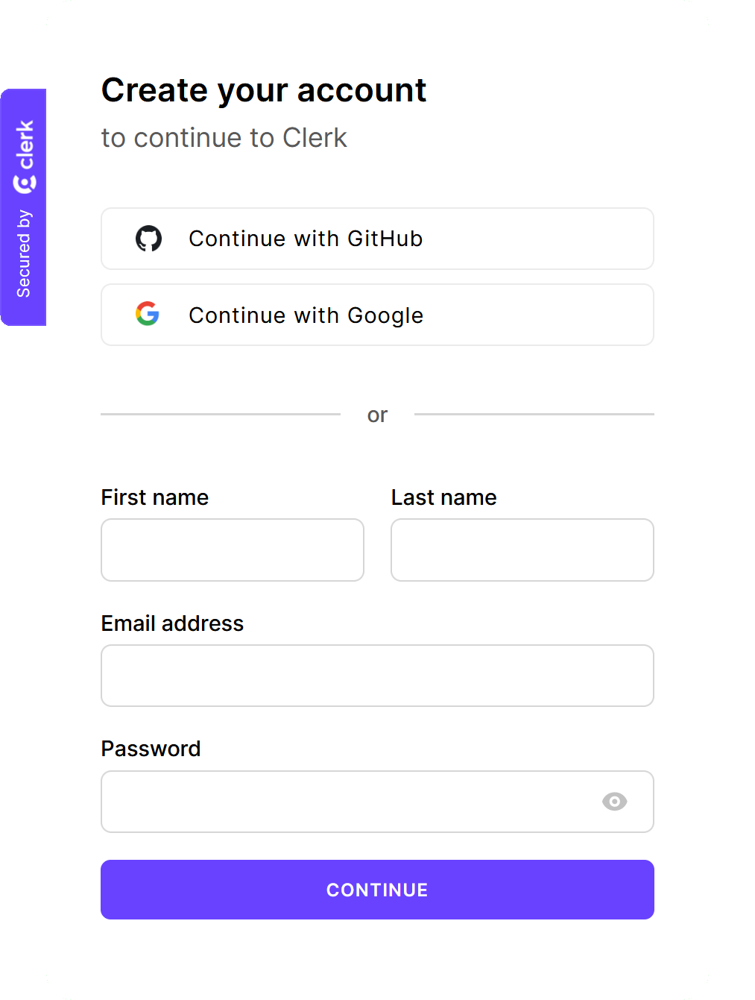
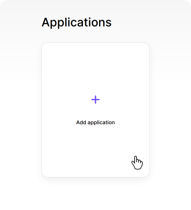
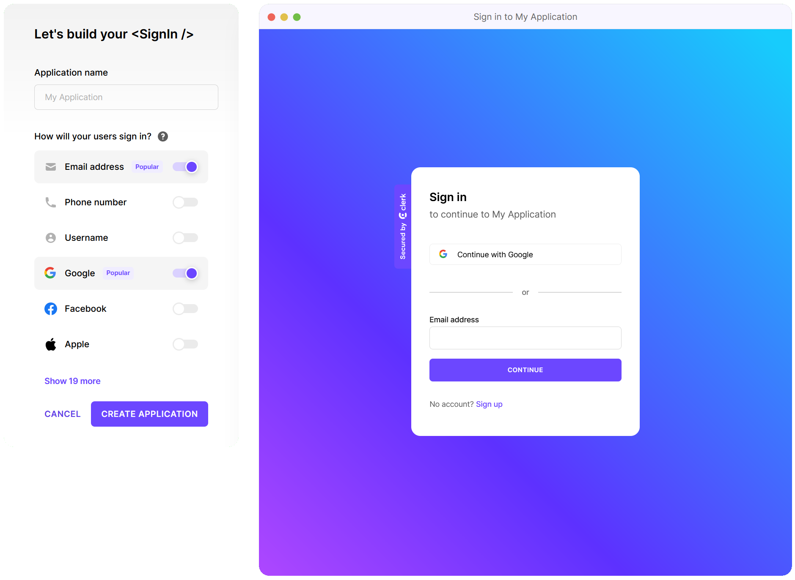

import {Cards} from "@/components/Cards";
import { Steps } from 'nextra-theme-docs'

# Setup Clerk

Let's set up a fresh Clerk account and start integrating it into a new application.

Migrating from another platform?

You might want to [check out one of our migration guides](/migrations-deployments/migrate-from/overview) to help
you move your data to Clerk.

Creating a Clerk account and using it in your apps is a simple three-step process:

<Steps>

    ### Step 1: Create a Clerk account

    [Go to Clerk's sign-up page](https://dashboard.clerk.com/sign-up) and create an account.

     
    {/* Don't move ![] to a new line, otherwise MDX adds a 
 tag and it breaks A11Y */}
    

     

    ### Step 2: Create a Clerk application

    Once you've created an account, you'll be redirected to [your Clerk dashboard](https://dashboard.clerk.com/).

    On a freshly created account, you won't have any applications. To create one, press the "Add application" card:

     
    {/* Don't move ![] to a new line, otherwise MDX adds a 
 tag and it breaks A11Y */}
    

     

    When the "Add application" card is pressed, you'll be directed to create your `<SignIn>` component, and select your preferred
    auth providers.

     
    {/* Don't move ![] to a new line, otherwise MDX adds a 
 tag and it breaks A11Y */}
    

     

    > [We provide over 20 authentication providers that you can utilize in your Clerk apps.](/users/authentication-providers/overview)

    Once done, you should see a list of API keys that make setting up a new codebase easier.

     
    {/* Don't move ![] to a new line, otherwise MDX adds a 
 tag and it breaks A11Y */}
    

     

    ### Step 3: Spin up a new codebase

    The API keys listed in the dashboard are just the first step to integrating Clerk into your apps. To get the most out
    of Clerk, check out our "Quickstart" guides:

    

        

            <Cards
                title="React"
                description="Set up your React codebase to integrate with Clerk."
                link="/quickstarts/frontend/react"
                cta="Get Started"
            />
            <Cards
                title="Next.js"
                description="Set up your Next.js codebase to integrate with Clerk."
                link="/quickstarts/full-stack/stable"
                cta="Get Started"
            />
            <Cards
                title="Remix"
                description="Set up your Remix codebase to integrate with Clerk."
                link="/quickstarts/full-stack/remix"
                cta="Get Started"
            />
            <Cards
                title="RedwoodJS"
                description="Set up your RedwoodJS codebase to integrate with Clerk."
                link="/quickstarts/full-stack/remix"
                cta="Get Started"
            />
            <Cards
                title="Expo / React Native"
                description="Set up your Expo or React Native codebase to integrate with Clerk."
                link="/quickstarts/native/expo"
                cta="Get Started"
            />
            <Cards
                title="Express.js"
                description="Set up your Express.js codebase to integrate with Clerk."
                link="#"
                cta="Coming Soon"
                hideArrow={true}
            />
            <Cards
                title="Fastify"
                description="Set up your Fastify codebase to integrate with Clerk."
                link="#"
                cta="Coming Soon"
                hideArrow={true}
            />
            <Cards
                title="Ruby / Rails"
                description="Set up your Ruby codebase to integrate with Clerk."
                link="#"
                cta="Coming Soon"
                hideArrow={true}
            />
        

    

</Steps>
