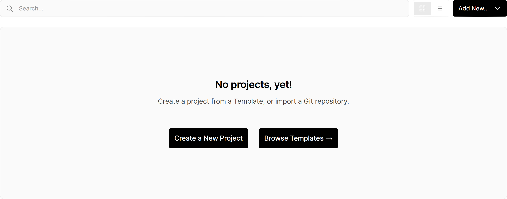
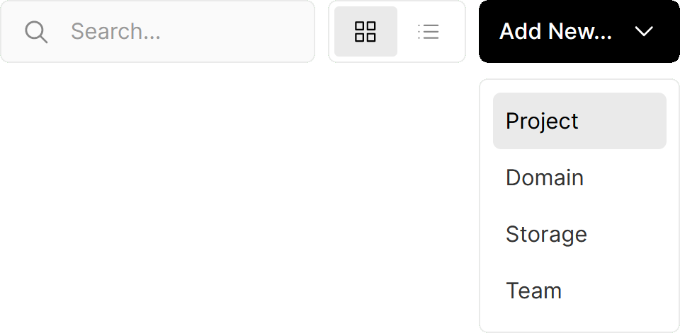
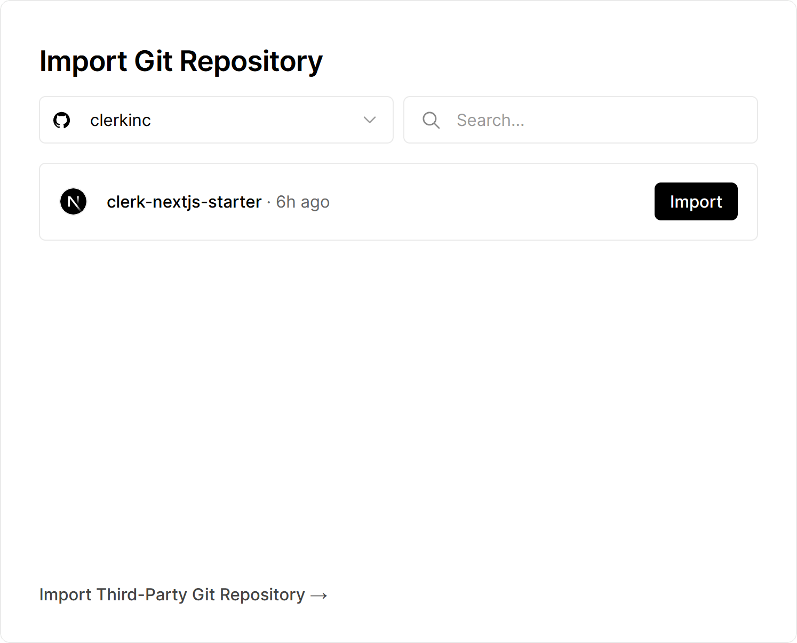
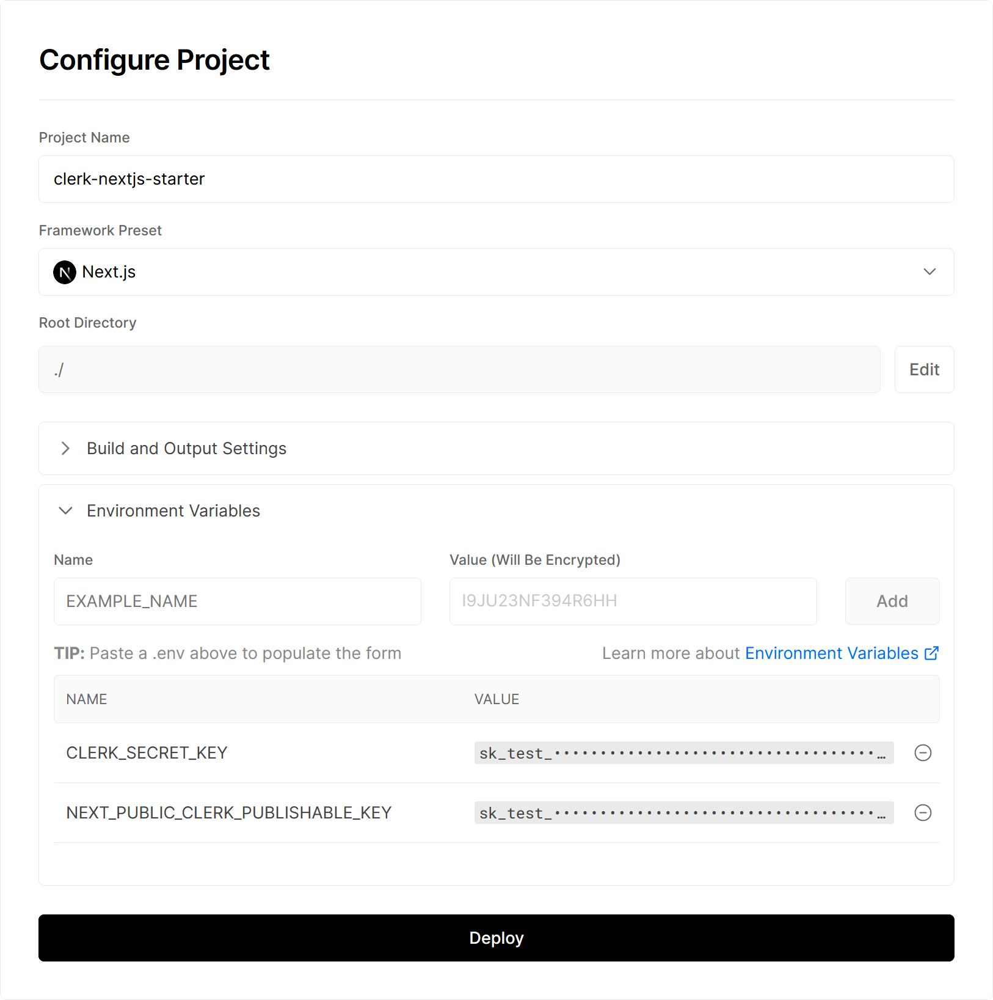
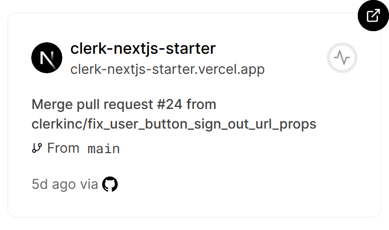
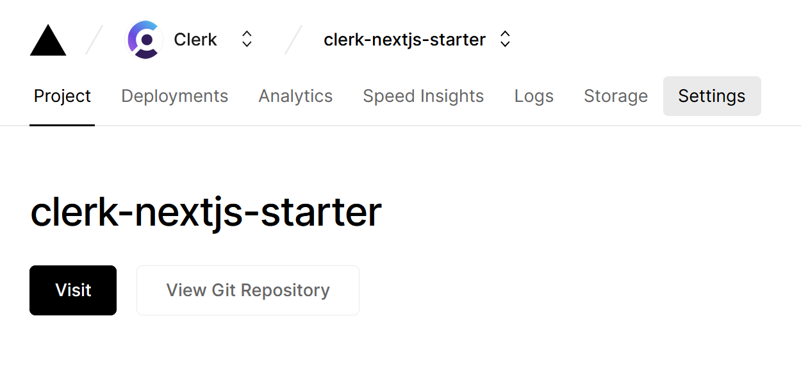
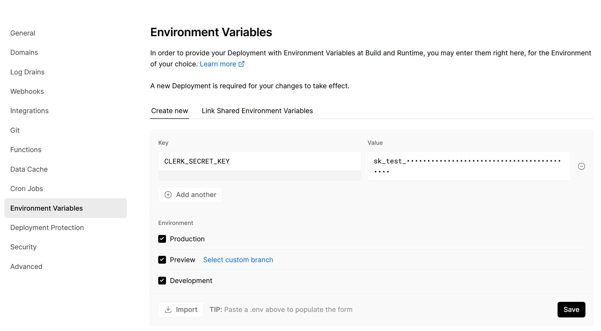

# Deploying a Clerk app to Vercel

Deploying a Clerk app to a Vercel project enables you to rapidly develop your applications and deploy them to production with ease.

Let's walk through:

*   How to set up a new Vercel project
*   How to integrate Clerk into your Vercel project
*   Supporting Vercel Preview URLs in your Clerk app

## Set up a new Vercel project

> This guide assumes that you have already [set up a Clerk application](/get-started/setup-clerk) that you're ready to deploy. If you haven't yet, be sure to [check out our guide to creating a new Clerk app](/get-started/setup-clerk).

To setup a new Vercel project, start by [going to your Vercel Dashboard](https://vercel.com/dashboard). Here, you'll see a list of your projects or, if you don't have any projects yet, a prompt to create a new project:

Create a new project by pressing the "Add New" button in the top right corner of the screen or by [pressing this link](https://vercel.com/new):

Once done, you'll see the option to import a Git repository. Find the repository you want to use and press "Import":

Once you've selected a project to deploy, you'll be directed to the "Configure Project" page.

On this page, **make sure to add "[Environment Variables](https://vercel.com/docs/concepts/projects/environment-variables)" from [your app's Clerk dashboard](https://dashboard.clerk.com/)** so that your Vercel project will be connected to your Clerk app properly:

The API keys added on this screen will be assigned to all deployments on Vercel, including preview URLs. To connect your first deployment to your Clerk app, be sure to **use your Clerk production API keys rather than your development API keys**.

> [You'll need to take additional steps to make sure Vercel preview URLs work as intended.](#support-vercel-preview-urls)

Once you press "Deploy", your app will deploy to production!

> You will likely want to [assign a custom domain to your Vercel project](https://vercel.com/docs/concepts/projects/domains/add-a-domain) once you've completed this step.

## Add Clerk API Keys to Existing Vercel Project

To add your Clerk API keys to an existing Vercel project, start by selecting your project [from your Vercel dashboard](https://vercel.com/dashboard):

On the details page for your project, go to "Settings" in the navigation bar at the top:

In the "Settings" sidebar, select "Environment Variables" and add your API keys from [your Clerk dashboard](https://dashboard.clerk.com/):

When adding Environment Variables, you can select which keys associate with which Vercel deployment Environments. You can use this to customize

## Support for Vercel Preview URLs \[#support-vercel-preview-urls]

When using Vercel's GitHub integrations, you'll

https://vercel.com/docs/concepts/deployments/generated-urls

Clerk redirects from preview URLs will be automatically handled for you when using our pre-built components and middleware.

https://vercel.com/docs/concepts/deployments/generated-urls#preview-deployment-suffix

> Please note that modifying the Preview Deployment Suffix is only available as an add-on to Vercel's Pro plans and above.
